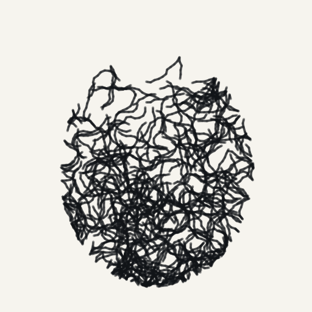

# Scribbler — Photo → Scribble Art (PWA)

A small, installable **Progressive Web App** that turns an uploaded photo into a
continuous pen‑scribble portrait, drawn **in realtime** right on the canvas.
Everything runs on the device — the photo is never uploaded anywhere.



## Features

- **Upload by drag‑and‑drop, file picker, or paste** (Ctrl/⌘+V).
- **Live pen drawing** — watch it draw as if by hand: each stroke is revealed
  progressively with a moving pen‑tip cursor, with a **Drawing speed** control
  and a **Show the pen** toggle. (Turn off *Animate the drawing* to render
  instantly.)
- **Hand‑scribbled strokes** — long, sweeping curves flow along the photo's
  tonal contours (hair, jawline, cheekbones) with a persistent "curl", a light
  second pen‑retrace over darks, and occasional stray overshoot lines, so the
  result reads like a real hand‑drawn scribble portrait rather than machine fuzz.
- **Single continuous line** — an optional mode that renders the whole portrait
  as one unbroken stroke (the pen never lifts): the detailed contour‑following
  scribbles are generated, then chained end‑to‑end by nearest endpoint so the
  pen draws them as a single line, preserving the facial detail.
- **One‑tap style presets** — *Sketch* (clean line‑art), *Bold* (heavier,
  dramatic strokes), and *Ink‑storm* (dense) set every slider at once. Your
  choice (and any manual tweaks) is **remembered** between visits and
  auto‑applied to the next photo.
- **Face fill** — a baseline ink demand across the subject so lit skin still
  gets light scribbles and the face reads fuller.
- **Remove background (subject only)** — on‑device subject segmentation isolates
  the person so ink stays on them and the background drops to clean paper. Uses
  **MediaPipe Selfie Segmentation** (runs in‑browser via WebAssembly, loaded
  from CDN and cached after first use); if it can't load, a colour‑keyed border
  flood‑fill takes over.
- **Trace facial features (likeness)** — **MediaPipe Face Landmarker** detects
  the eyes, brows, nose, lips, and jawline and draws them as guaranteed lines so
  the portrait actually resembles the subject (especially in single‑line mode).
  Skips gracefully when no face is detected.
- **Live controls**: density, contrast, scribble size, flow (chaotic ↔ contour),
  line weight, ink opacity, plus ink/paper colours.
- **Save PNG** of the finished artwork (high‑res).
- **Installable & offline** — PWA manifest + service worker cache the app shell.

## How it works

1. The photo is sampled into a small **tone map** (luminance grid).
2. A **contour field** is derived from the image gradient (Sobel) so strokes can
   flow along iso‑tone lines.
3. A **residual ink field** tracks how much ink each region still "wants"
   (darker = more). The engine repeatedly:
   - picks a dark spot (rejection sampling on the residual field),
   - lays down a short scribble stroke that follows the local contour with
     jitter, and
   - **subtracts** the ink it deposited so coverage self‑balances and tones come
     out even instead of clumping.

Strokes are drawn in batches via `requestAnimationFrame`, which is what makes the
drawing animate smoothly in realtime.

When **Remove background** is on, MediaPipe Selfie Segmentation produces a
subject matte first; the residual ink field is zeroed outside the subject so no
strokes land on the background. When **Trace facial features** is on, MediaPipe
Face Landmarker contributes feature lines that are drawn last (scribble mode) or
woven into the path (single‑line mode).

All logic lives in [`app.js`](app.js); no build step. The only external
dependencies are the optional MediaPipe models, loaded lazily from a CDN on
first use and cached by the browser thereafter — so the first analysis needs a
network connection, but the rest of the app (and later runs) works offline, and
if the models can't load the app falls back to flood‑fill with no face traces.

`_render_photo.py` is a dev‑only harness that mirrors the engine for eyeballing
output without a browser; it is not part of the shipped app.

## Run it locally

It's a static site — serve the folder over HTTP (a service worker needs
`http://`/`https://`, not `file://`):

```bash
cd scribble-pwa
python3 -m http.server 8000
# open http://localhost:8000
```

To install as an app, open it in Chrome/Edge/Safari and use **Install app** /
**Add to Home Screen**.

## Deploy

Drop the `scribble-pwa/` folder onto any static host (GitHub Pages, Netlify,
Vercel, Cloudflare Pages, S3, etc.). No server code required.

## Regenerating icons

App icons are generated by a dependency‑free script:

```bash
python3 make_icons.py
```
